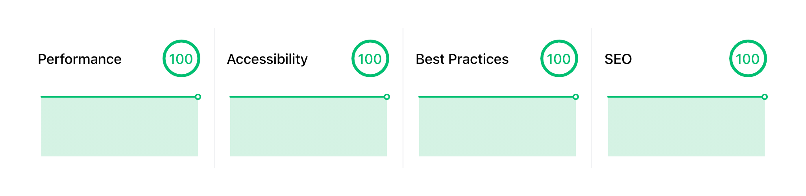

import { BlockInfo, BlockWarning } from '@components'

<BlockWarning>
  <strong>Disclaimer:</strong> this static website was built from the ground up as a hobby to maintain, or at best
  develop my understanding. Feel free to drop me a message if you want to share some advice. The code is publicly
  accessible <a href="https://github.com/2n3g5c9/marcm-dev" aria-label="GitHub repository" target="_blank" rel="noopener noreferrer">on GitHub</a>.
</BlockWarning>

# Context

## Motivation

* Keep up with [React](https://reactjs.org/)/[TypeScript](https://www.typescriptlang.org/) core concepts, and modern
front-end web development workflows.
* Maintain basic knowledge of web design, without the overhead of writing layers of wrapper components.

## Requirements

* High performance ([Core Web Vitals](https://web.dev/vitals/)) on all pages, wherever the reader is: across the
globe... or in the Tube.
* Free hosting: no server-side logic and low traffic is expected.
* High security standards (X.509 certificate, HTTP Security Headers,
[CSP](https://developers.google.com/web/fundamentals/security/csp), etc.), because everyone should care.
* Acceptable level of accessibility ([axe benchmark](https://www.deque.com/axe/)), to include all readers regardless
of disabilities.
* Automated dependency updates (not recommended in production), to minimise my time in JavaScript dependency hell.
* Headless CMS integration is not an immediate requirement, but could be at some point.

# High-Level Design

## Development

### Static Site Generator
* Integrates with React/TypeScript for modularity and aforementioned rationale.
* Adheres to [Jamstack](https://jamstack.org/) architecture principles (JavaScript, APIs & Markup) and renders
[MDX](https://mdxjs.com/) (Markdown with embedded JSX).
* Bootstraps SEO, bundling, building and service worker ([PWA](https://developers.google.com/web/ilt/pwa))
configurations, as well as various optimisation techniques (code splitting, image processing and serving
([WebP](https://developers.google.com/speed/webp) and/or [AVIF](https://aomedia.org/av1-features/get-started/)),
preload/prefetch, tree shaking, etc.).

### CSS Library
* Bootstraps building blocks for standards-compliant web design elements.
* Reduces the amount of CSS code, while ensuring a degree of overall coherence in the web design.
* Offers the ability to write CSS-in-JS to embed conditional styling in components, and reduces the risk of unintended
cascading style.

## Operations

### Version Control System (VCS)
* Organises, stores and versions the code.
* Decouples and reconciles development workflows with "production" code.
* Unlocks automation and Ops-oriented workflows with SaaS integrations.

### Continuous Integration (CI)
* Triggered on push/merge to all branches, gives enough confidence that the code is in a stable state to be deployed.
* Lint checks: detect structural problems and improves code quality with static code analysis.
* Type checks: detect type mismatches with static code analysis.
* Snapshot tests: detect unexpected changes in UI components rendering.
* Accessibility tests: detect drift with basic axe accessibility compliance checks.
* Code quality checks: detect bugs, code duplication and code smells.
* Security audit: detects vulnerabilities in the code with semantic code analysis.
* Best practices audit: detects UX regressions with industry standard practices checks.

### Continuous Deployment (CD)
* Often offered by the CDN service, by passing an NPM script command.
* Triggered by a push/merge on the production branch.

### Dependency Management
* Periodically looks for JavaScript package updates.
* Triggers the CI pipeline and auto-merges to the production branch if all tests pass.

### Global Content Delivery Network (CDN)
* Serves cached static assets from globally distributed PoPs, providing both high availability and performance.
* Handles asset compression ([GZIP](https://www.gnu.org/software/gzip/) & [Brotli](https://github.com/google/brotli)).
* Manages TLS for free (via [Let's Encrypt](https://letsencrypt.org/)): HTTP/2, TLS 1.2 & 1.3 only, PFS.

# Tech Stack

<BlockInfo>
  <strong>Note for beginners:</strong> there is no silver bullet, and the tech stack doesn't matter as much as the
  high-level design ; as long as you stick with it long enough to understand it.
</BlockInfo>

## Development

### Static Site Generator

Among the considered options were:

* [Gatsby](https://www.gatsbyjs.com/): based on React, leverages [GraphQL](https://graphql.org/) for its unified data
layer, relies on its ecosystem of plugins.
* [Next.js](https://nextjs.org/): based on React, additionally handles SSR, maintained by [Vercel](https://vercel.com/).
* [Eleventy (11ty)](https://www.11ty.dev/): able to inject React components, but meant to be simpler (based on
independent template engines like [Nunjucks](https://mozilla.github.io/nunjucks/)).

I went with Gatsby as I already had prior experience with the stack, but can't find any good reason not to recommend
Next.js. Injecting React components with 11ty felt a bit bloated, but you should give it a go if you're looking for the
simplest workflow. I first wrote a
[TypeScript and Tailwind CSS minimal starter](https://github.com/2n3g5c9/gatsby-starter-typescript-tailwindcss) for
Gatsby, and iteratively extended it to what it is today.

`.prettierrc` defines formatting rules which are kept fairly close to [Prettier](https://prettier.io/)'s default
directives.

**Gatsby Browser APIs:**
* The `wrapRootElement` API has been used to wrap the root element with the `MDXProvider` which includes `shortcodes`
for the design system.
* The `onServiceWorkerUpdateReady` API has been used for the service worker to auto-refresh the client cache on change,
which sometimes conflicts with the MDX design system.

**Gatsby Node APIs:**
* The `onCreateWebpackConfig` API has been used to set Webpack aliases for module resolution, and remove the source maps
that are included by default in production with Gatsby.
* The `createPages` API has been used to create templated note pages based on existing MDX files: `/notes/*`
* The `onCreateNode` API has been used to create GraphQL nodes that help reference existing notes: `/notes`

### CSS Library

Among the considered options were (not directly opposed):

* [Tailwind CSS](https://tailwindcss.com/) (with [PostCSS](https://postcss.org/)): based on pre-baked utility-classes,
reduces the amount of CSS code but highly opinionated and difficult to migrate from.
* [Styled Components](https://styled-components.com/): based on injected CSS code in React components via tagged
template literals.

I went with Tailwind CSS and PostCSS as my previous experience with Styled Components ended up in writing layers of
styled wrapper components which were hard to reason about. Utility-classes eventually made it slightly more compact and
easier to read.

**Configuration:**
* `tailwind.config.js` declares custom utility-classes to extend the base library (e.g. types of colors, margins,
animations, fonts, etc.).
* `src/assets/css/global.css` defines global CSS rules, such as theme colors. I tried to stick to a minimalist color
palette, as declining it for a dark theme and insuring contrast ratios match accessibility expectations is a lot of
extra work.
* `gatsby-config.js` defines [PurgeCSS](https://purgecss.com/) safelists for a few utility-classes injected in MDX files
that would get excluded by the purge algorithm.

## Operations

### Version Control System

I wasn't really going for anything other than [Git](https://git-scm.com/), but for repository management, I considered:

* [GitHub](https://github.com/): owned by Microsoft, free plan includes unlimited public/private repositories, unlimited
Actions on public repositories and 2,000 Actions minutes/month on private repositories.
* [GitLab](https://about.gitlab.com/): offers more integrated features out of the box, free plan includes unlimited
public/private repositories, 400 CI/CD minutes/month.

I sticked with GitHub which already hosts most of my Git repositories, but GitLab would have been an equally good fit.
They are both compatible with a wide range of services, including the options I considered to build my CI/CD pipeline.

**Repository organization:**
* Overall it's a bit erratic, I'm mostly experimenting and I intend to be the sole contributor.
* It's meant to have a protected `main` branch and manually merged feature branches triggering automated checks.

### Continuous Integration (CI)

Among the considered options were:

* [GitHub Actions](https://github.com/features/actions): out-of-the-box integration with GitHub, large collection of
pre-built Actions, free plan includes unlimited Actions on public repositories and 2,000 Actions minutes/month on
private repositories.
* [Circle CI](https://circleci.com/): past experience with the product, free plan includes 2,500 free credits/week
(~1,000 minutes in a Linux environment).
* [Travis CI](https://travis-ci.org/): free plan includes 10,000 credits/month (~1,000 minutes in a Linux environment).

It's ultimately a bit inconsistent to compare minutes or credits for different offerings, but given the potential of
GitHub Actions and the fact that it was natively integrated with GitHub, I decided to give it a try.

**Automated checks:**
* `.github/workflows/ci.yml` defines automated checks on push and pull requests (via NPM scripts). `node_modules` is
cached with `actions/cache` and a [ZSTD](https://facebook.github.io/zstd/) compressed archive is used as shared artifact
for subsequent tests running in parallel.
* `.eslintrc.js` defines linting rules, in addition to the `@typescript-eslint` and `react` plugins.
* Types are checked statically with TypeScript, and at runtime with `PropTypes`. To avoid typing duplication, TypeScript
types are inferred from `PropTypes` via `InferProps` wherever possible.
* `src/components/__tests__` defines simple snapshot tests. Component rendering tests are written with
[Jest](https://jestjs.io/) and default props for simplicity's sake.
* `cypress/e2e/accessibility.test.js` defines accessibility tests, and bootstrapped with
[Cypress](https://www.cypress.io/). Strict compliance with axe web rules are checked on the main pages.
* [SonarCloud](https://sonarcloud.io/) ensures the code complies with high quality standards by passing the quality
gate.
* `.github/workflows/codeql-analysis.yml` defines automated code vulnerability scanning by leveraging
[CodeQL](https://codeql.github.com/), which is also known as the project behind [LGTM](https://lgtm.com/).
* `lighthouserc.js` sets expectations on the automated [Lighthouse](https://github.com/GoogleChrome/lighthouse-ci)
audit results.

### Dependency Management

Among the considered options were:

* [Depfu](https://depfu.com/): previous experience with the tool, gives more control over the update strategy like
support for grouped updates, configuration from Web UI, supports auto-merge, free for public and private repositories.
* [Dependabot](https://dependabot.com/): tight integration with GitHub, configuration from file, supports more
languages, doesn't natively support auto-merge, free for public and private repositories.

I went with Depfu for its more advanced update strategies, and a straightforward auto-merging process. I still use
Dependabot for GitHub Actions and security alerts. The coverage of the aforementioned automated checks gave enough
confidence about the ability to identify breaking changes on a specific dependency. If it breaks, rolling back is
fast and easy.

### Global Content Delivery Network (CDN)

Among the considered options were:

* [Vercel](https://vercel.com/): past experience with the product, supports TLS 1.2 & 1.3, supports GZIP & Brotli, free
plan includes 100 GB bandwidth per month.
* [Gatsby Cloud](https://www.gatsbyjs.com/products/cloud/): supports TLS 1.2, supports GZIP, faster incremental Gatsby
builds, free plan includes 5M requests and 100 GB bandwidth per month.
* [Netlify](https://www.netlify.com/): supports TLS 1.2 & 1.3, supports GZIP & Brotli, free plan includes 100 GB
bandwidth per month.

I tried both Vercel and Gatsby Cloud with Gatsby v3 and sticked with Vercel for the following reasons: consistently
50% faster page loads in most regions (according to [WebPageTest](https://www.webpagetest.org/)), supports TLS 1.3 and
Brotli, incremental builds were not really that fast.

# Performance Goals

To prevent falling in the rabbit hole of micro-optimization, I set quantitative performance goals from the start. Even
if those are not representative of the overall user experience (most of the data is fetched on the first visit, content
is preloaded, and a service worker caches files locally), this will ensure a sufficient amount of good practices are in
place (or at least guide me in the right direction).

* **Largest Contentful Paint** (mesures loading performance) must be under 2.5s (p75) in the US West Coast (0.301s),
US East Coast (0.471s), London (0.340s) and Tokyo (0.754s) ✅
* **Cumulative Layout Shift** (measures visual stability) must be under 0.1 (p75) in the US West Coast (0), US East
Coast (0), London (0) and Tokyo (0) ✅

## Lighthouse

Without contest the most well-known automated web auditing tool:
[Lighthouse](https://developers.google.com/web/tools/lighthouse) by Google.

Achieving all perfect scores in Lighthouse (Chrome 91) wasn't that hard with Gatsby & Vercel. But it certainly became
more challenging with things like service worker registration, or custom font preloading in the critical rendering path
(to avoid flickering). Even if this improves the overall user experience on the website, it will impact the performance
score negatively.

Results from [web.dev/measure](https://web.dev/measure/) can vary a lot between runs (probably ran in containers with a
small amount of resources from different locations), but it eventually gave some good results.

If you want more consistent performance results from remote Lighthouse reports, have a look at
[PageSpeed Insights](https://developers.google.com/speed/pagespeed/insights/).

## WebPageTest

Another popular automated audit tool is [WebPageTest](https://www.webpagetest.org/). Here the goal was to get the
highest possible scores in the regions I was interested in.

# Security Goals

Most attack vectors are taken care of by the front-end framework's design, and the fact that it only serves static
content (including client-side executable code):
* **Cross-Site Scripting (XSS):** avoided by automatically escaping HTML in JSX elements, and adding a restrictive
[Content Security Policy (CSP)](https://content-security-policy.com/).
* **Cross-Site Request Forgery (CSRF):** avoided by only allowing `GET` requests (via the
`Access-Control-Allow-Methods` HTTP header), and not using cookies (but if we were to, the `X-CSRF-Token` HTTP header is
expected).
* **Third-party scripts:** no third-party script is currently used.
* **Dependencies:** avoided by updating them weekly to ensure the latest security fixes are applied as they are
available. In addition, Dependabot's GitHub integration will alert if a vulnerability has been found in one of the
dependencies. We could argue this opens the door to automatically merging malicious code, but I can't review dozens of
updates every week.
* **DNS cache poisoning and spoofing:** avoided by enabling
[DNSSEC](https://www.icann.org/resources/pages/dnssec-what-is-it-why-important-2019-03-05-en) on
[Google Domains](https://domains.google.com).
* **Man-in-the-middle and TLS attacks:** avoided by delegating TLS to Vercel/Let's Encrypt (which only allows TLS 1.2 &
1.3 negotiation), and enabling HTTP Strict Transport Security (HSTS).

<BlockInfo>
  <strong>Note:</strong> unfortunately at the time of writing, the Mozilla Observatory scanner only reads the CSP if
  it's included in a meta tag, it ignores the HTTP header.
</BlockInfo>

## Snyk

[Snyk](https://snyk.io/) will look for JavaScript libraries with vulnerabilities, and that the following HTTP security
headers are set: `strict-transport-security`, `x-content-type-options`, `x-frame-options`, `content-security-policy` and
`x-xss-protection`.

## Qualys SSL Labs

[Qualys SSL Labs](https://www.ssllabs.com/ssltest/) will check that the certificate complies with a long list of
industry-standard best practices.

## ImmuniWeb

[ImmuniWeb](https://www.immuniweb.com/ssl/) is similar to Qualys SSL Labs, but also checks compliance with PCI DSS,
HIPAA and NIST certifications.

## Security Headers

[Security Headers](https://securityheaders.com/) will check that HTTP security headers are correctly set and enforce
strong security practices.

<BlockWarning>
  <strong>Warning:</strong> two caveats about using a CDN are that the <code>access-control-allow-origin</code> header
  has to be set to <code>*</code>, and that the CSP needs to contain <code>unsafe-inline</code> which will lower the
  score.
</BlockWarning>

# Future Work

* Add more implementation details to this page.
* Refine automated testing.
* Improve dark mode switching.
* Implement a scroll tracking table of content for notes.

That's it, feel free to share your advice!
